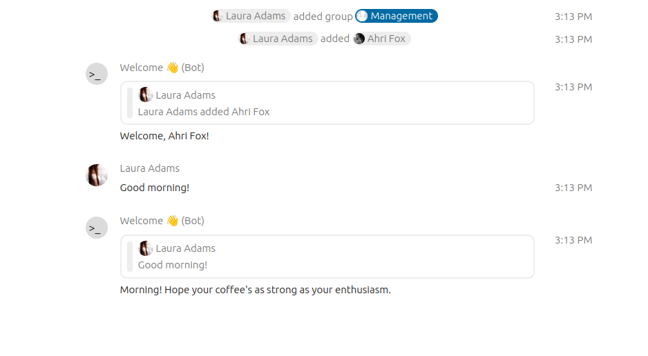

# Welcome bot 👋
A Golang sample bot that responds to "Good morning" and "Hello" and welcomes new attendees in the room




## Installation

1. Generate a secret
2. Install the bot via OCC:

    ```bash
    sudo -u www-data php occ talk:bot:install "Welcome 👋" "RANDOM FROM STEP 1" "http://localhost:8088/welcome"
    ```

3. Enable in your conversation